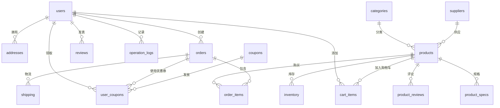

# 多彩商城数据库设计文档

# 数据表清单

### 1. 用户表(users)

| 字段       | 类型         | 约束                      | 说明     |
| ---------- | ------------ | ------------------------- | -------- |
| id         | bigint       | PRIMARY KEY               | 用户ID   |
| username   | varchar(50)  | UNIQUE, NOT NULL          | 用户名   |
| password   | varchar(100) | NOT NULL                  | 加密密码 |
| email      | varchar(100) | UNIQUE                    | 邮箱     |
| phone      | varchar(20)  | UNIQUE                    | 手机号   |
| status     | tinyint      | DEFAULT 1                 | 账号状态 |
| created_at | timestamp    | DEFAULT CURRENT_TIMESTAMP | 创建时间 |

### 2. 商品表(products)

| 字段         | 类型          | 约束        | 说明     |
| ------------ | ------------- | ----------- | -------- |
| id           | bigint        | PRIMARY KEY | 商品ID   |
| name         | varchar(100)  | NOT NULL    | 商品名称 |
| category_id  | bigint        | FOREIGN KEY | 分类ID   |
| price        | decimal(10,2) | NOT NULL    | 销售价   |
| market_price | decimal(10,2) |             | 市场价   |
| main_image   | varchar(255)  |             | 主图URL  |
| description  | text          |             | 商品描述 |
| sales        | int           | DEFAULT 0   | 销量     |
| status       | tinyint       | DEFAULT 1   | 状态     |

### 3. 商品规格表(product_specs)

| 字段       | 类型          | 约束        | 说明     |
| ---------- | ------------- | ----------- | -------- |
| id         | bigint        | PRIMARY KEY | 规格ID   |
| product_id | bigint        | FOREIGN KEY | 关联商品 |
| name       | varchar(50)   | NOT NULL    | 规格名称 |
| value      | varchar(100)  | NOT NULL    | 规格值   |
| price_diff | decimal(10,2) | DEFAULT 0   | 价格差异 |
| image      | varchar(255)  |             | 规格图片 |

### 4. 商品评论表(product_reviews)

| 字段         | 类型    | 约束        | 说明      |
| ------------ | ------- | ----------- | --------- |
| id           | bigint  | PRIMARY KEY | 评论ID    |
| user_id      | bigint  | FOREIGN KEY | 用户ID    |
| product_id   | bigint  | FOREIGN KEY | 商品ID    |
| order_id     | bigint  | FOREIGN KEY | 订单ID    |
| content      | text    | NOT NULL    | 评论内容  |
| rating       | tinyint | NOT NULL    | 评分(1-5) |
| images       | json    |             | 评论图片  |
| is_anonymous | tinyint | DEFAULT 0   | 是否匿名  |

### 5. 分类表(categories)

| 字段      | 类型        | 约束        | 说明     |
| --------- | ----------- | ----------- | -------- |
| id        | bigint      | PRIMARY KEY | 分类ID   |
| name      | varchar(50) | NOT NULL    | 分类名称 |
| parent_id | bigint      | FOREIGN KEY | 父分类ID |
| level     | tinyint     | DEFAULT 1   | 分类层级 |
| sort      | int         | DEFAULT 0   | 排序权重 |

### 6. 购物车表(cart_items)

| 字段       | 类型    | 约束        | 说明       |
| ---------- | ------- | ----------- | ---------- |
| id         | bigint  | PRIMARY KEY | 购物车项ID |
| user_id    | bigint  | FOREIGN KEY | 用户ID     |
| product_id | bigint  | FOREIGN KEY | 商品ID     |
| spec_id    | bigint  | FOREIGN KEY | 规格ID     |
| quantity   | int     | DEFAULT 1   | 数量       |
| selected   | tinyint | DEFAULT 1   | 是否选中   |

### 7. 订单表(orders)

| 字段         | 类型          | 约束        | 说明     |
| ------------ | ------------- | ----------- | -------- |
| id           | bigint        | PRIMARY KEY | 订单ID   |
| order_no     | varchar(50)   | UNIQUE      | 订单编号 |
| user_id      | bigint        | FOREIGN KEY | 用户ID   |
| total_amount | decimal(10,2) | NOT NULL    | 订单总额 |
| status       | varchar(20)   | NOT NULL    | 订单状态 |
| address_id   | bigint        | FOREIGN KEY | 收货地址 |
| payment_time | datetime      |             | 支付时间 |

### 8. 订单明细表(order_items)

| 字段          | 类型          | 约束        | 说明     |
| ------------- | ------------- | ----------- | -------- |
| id            | bigint        | PRIMARY KEY | 明细ID   |
| order_id      | bigint        | FOREIGN KEY | 订单ID   |
| product_id    | bigint        | FOREIGN KEY | 商品ID   |
| product_name  | varchar(100)  | NOT NULL    | 商品名称 |
| product_image | varchar(255)  |             | 商品图片 |
| price         | decimal(10,2) | NOT NULL    | 单价     |
| quantity      | int           | NOT NULL    | 数量     |

### 9. 物流表(shippings)

| 字段           | 类型        | 约束        | 说明     |
| -------------- | ----------- | ----------- | -------- |
| id             | bigint      | PRIMARY KEY | 物流ID   |
| order_id       | bigint      | FOREIGN KEY | 订单ID   |
| shipping_no    | varchar(50) | NOT NULL    | 物流单号 |
| company        | varchar(50) | NOT NULL    | 物流公司 |
| status         | varchar(20) | NOT NULL    | 物流状态 |
| receiver       | varchar(50) | NOT NULL    | 收货人   |
| receiver_phone | varchar(20) | NOT NULL    | 收货电话 |

### 10. 库存表(inventory)

| 字段         | 类型   | 约束        | 说明       |
| ------------ | ------ | ----------- | ---------- |
| id           | bigint | PRIMARY KEY | 库存ID     |
| product_id   | bigint | FOREIGN KEY | 商品ID     |
| spec_id      | bigint | FOREIGN KEY | 规格ID     |
| quantity     | int    | NOT NULL    | 库存数量   |
| warehouse_id | bigint | FOREIGN KEY | 仓库ID     |
| low_stock    | int    | DEFAULT 5   | 低库存预警 |

### 11. 供应商表(suppliers)

| 字段          | 类型         | 约束        | 说明       |
| ------------- | ------------ | ----------- | ---------- |
| id            | bigint       | PRIMARY KEY | 供应商ID   |
| name          | varchar(100) | NOT NULL    | 供应商名称 |
| contact       | varchar(50)  | NOT NULL    | 联系人     |
| contact_phone | varchar(20)  | NOT NULL    | 联系电话   |
| address       | varchar(255) |             | 供应商地址 |
| status        | tinyint      | DEFAULT 1   | 合作状态   |

### 12. 优惠券表(coupons)

| 字段       | 类型          | 约束        | 说明       |
| ---------- | ------------- | ----------- | ---------- |
| id         | bigint        | PRIMARY KEY | 优惠券ID   |
| name       | varchar(100)  | NOT NULL    | 优惠券名称 |
| type       | varchar(20)   | NOT NULL    | 优惠类型   |
| amount     | decimal(10,2) | NOT NULL    | 优惠金额   |
| min_amount | decimal(10,2) | DEFAULT 0   | 最低消费   |
| start_time | datetime      | NOT NULL    | 开始时间   |
| end_time   | datetime      | NOT NULL    | 结束时间   |

### 13. 用户优惠券表(user_coupons)

| 字段      | 类型        | 约束        | 说明       |
| --------- | ----------- | ----------- | ---------- |
| id        | bigint      | PRIMARY KEY | 记录ID     |
| user_id   | bigint      | FOREIGN KEY | 用户ID     |
| coupon_id | bigint      | FOREIGN KEY | 优惠券ID   |
| status    | varchar(20) | NOT NULL    | 使用状态   |
| order_id  | bigint      | FOREIGN KEY | 使用的订单 |
| get_time  | datetime    | NOT NULL    | 领取时间   |

### 14. 操作日志表(operation_logs)

| 字段           | 类型        | 约束        | 说明     |
| -------------- | ----------- | ----------- | -------- |
| id             | bigint      | PRIMARY KEY | 日志ID   |
| user_id        | bigint      | FOREIGN KEY | 用户ID   |
| module         | varchar(50) | NOT NULL    | 操作模块 |
| operation      | varchar(50) | NOT NULL    | 操作类型 |
| params         | text        |             | 操作参数 |
| ip             | varchar(50) |             | IP地址   |
| operation_time | datetime    | NOT NULL    | 操作时间 |
### 15图片表（images）

| 字段名     | 类型              | 必填 | 默认值            | 描述                                                         |
| ---------- | ----------------- | ---- | ----------------- | ------------------------------------------------------------ |
| id         | bigint unsigned   | 是   | 无                | 主键 ID，自增                                                |
| url        | varchar(255)      | 是   | 无                | 图片访问 URL                                                 |
| path       | varchar(255)      | 是   | 无                | 图片存储路径                                                 |
| type       | tinyint           | 是   | 1                 | 图片类型：1 - 商品图 2 - 用户头像 3 - 评价图 4 - 广告图 5 - 其他 |
| related_id | bigint unsigned   | 否   | null              | 关联的业务 ID (商品 ID / 用户 ID 等)                         |
| name       | varchar(100)      | 否   | null              | 图片原始文件名                                               |
| size       | int unsigned      | 否   | null              | 图片大小 (字节)                                              |
| width      | smallint unsigned | 否   | null              | 图片宽度 (像素)                                              |
| height     | smallint unsigned | 否   | null              | 图片高度 (像素)                                              |
| format     | varchar(10)       | 否   | null              | 图片格式 (jpg/png/gif 等)                                    |
| hash       | varchar(32)       | 否   | null              | 图片 MD5 哈希值                                              |
| is_main    | tinyint(1)        | 否   | 0                 | 是否主图 (1 是 0 否)                                         |
| sort_order | smallint          | 否   | 99                | 排序权重 (越小越靠前)                                        |
| status     | tinyint(1)        | 否   | 1                 | 状态：0 - 禁用 1 - 启用                                      |
| created_at | timestamp         | 否   | CURRENT_TIMESTAMP | 创建时间                                                     |
| updated_at | timestamp         | 否   | CURRENT_TIMESTAMP | 更新时间                                                     |
| created_by | bigint unsigned   | 否   | null              | 创建人 ID                                                    |
| updated_by | bigint unsigned   | 否   | null              | 更新人 ID                                                    |

# 完整表关系图

# 索引设计

1. **用户相关**:
   - `users(username, email, phone)` 唯一索引
   - `operation_logs(user_id, operation_time)` 复合索引

2. **商品相关**:
   - `products(category_id, status)` 复合索引
   - `product_specs(product_id)` 索引
   - `inventory(product_id, warehouse_id)` 复合索引

3. **订单相关**:
   - `orders(user_id, status, created_at)` 复合索引
   - `order_items(order_id)` 索引
   - `shipping(order_id)` 索引

4. **其他**:
   - `coupons(status, start_time, end_time)` 复合索引
   - `user_coupons(user_id, status)` 复合索引